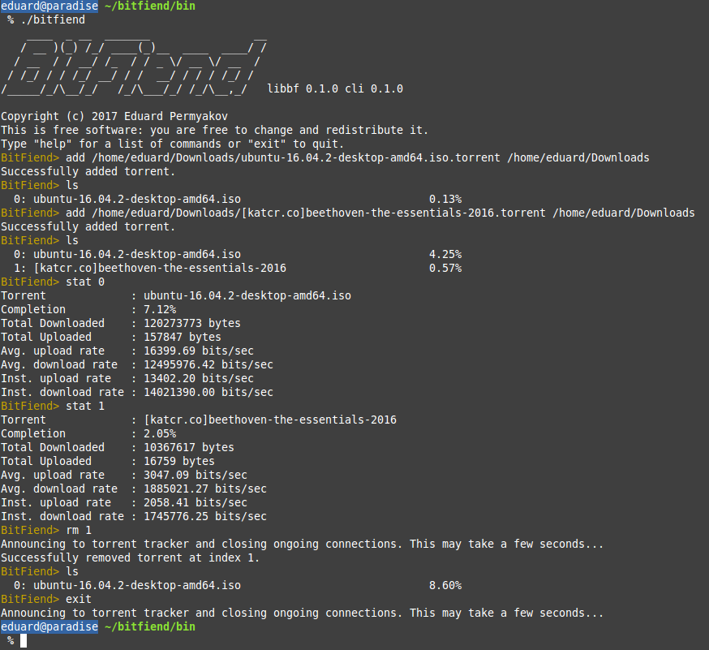

BitFiend is a BitTorrent client written in C. It is multithreaded with POSIX threads. 
It can be built for Linux and has a command line interface. 

The client has successfully torrented Ubuntu ISOs, academic torrents, and various 
multimedia files from popular torrent websites. It should work with most torrents!

At the moment, the client still lacks some non-essential features. I plan to 
continue to extend its' functionality in the future.

## Building BitFiend ##

To build the command-line client, run `make bfcli` in the top-level directory.

To build the core of BitFiend as a static library, run `make libbf` in the top-level
directory. The library API can be found in `libbf/bitfiend.h`

BitFiend does not depend on any third party libraries. It requires a C99 compiler with 
GNU extensions as well as POSIX compliance. Some non-portable Linux-specific code is
present.

## Example BitFiend Session ##

